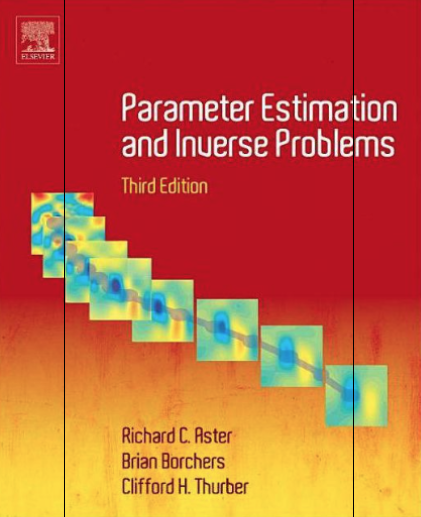

# peiplib


<p style="width:15%; float:right; padding-left: 50px;">
    
</p>

Implementing library and examples for the 3rd edition of **Parameter
Estimation and Inverse Problems** (by R. Aster, B. Borchers, C. Thurber)
into Python.

The book provides codes and associated data in MATLAB to implement
examples. This project, however, implements the same stuff into Python.
In this repository, the examples are illustrated using Jupyter
Nootebook environment.

## Download and Installation

`peiplib` is an installable library, and NumPy-style docstrings is used
to documnet functions, classes etc.

```
git clone https://github.com/nimanzik/peiplib
cd peiplib
pip install .
```

or use `pip install -e .` to install in developer (editable) mode.

## Contact Information
This repository is still a work in progress. Any feedback/suggestions
are welcome.

- Nima Nooshiri - nima.nooshiri@gmail.com
